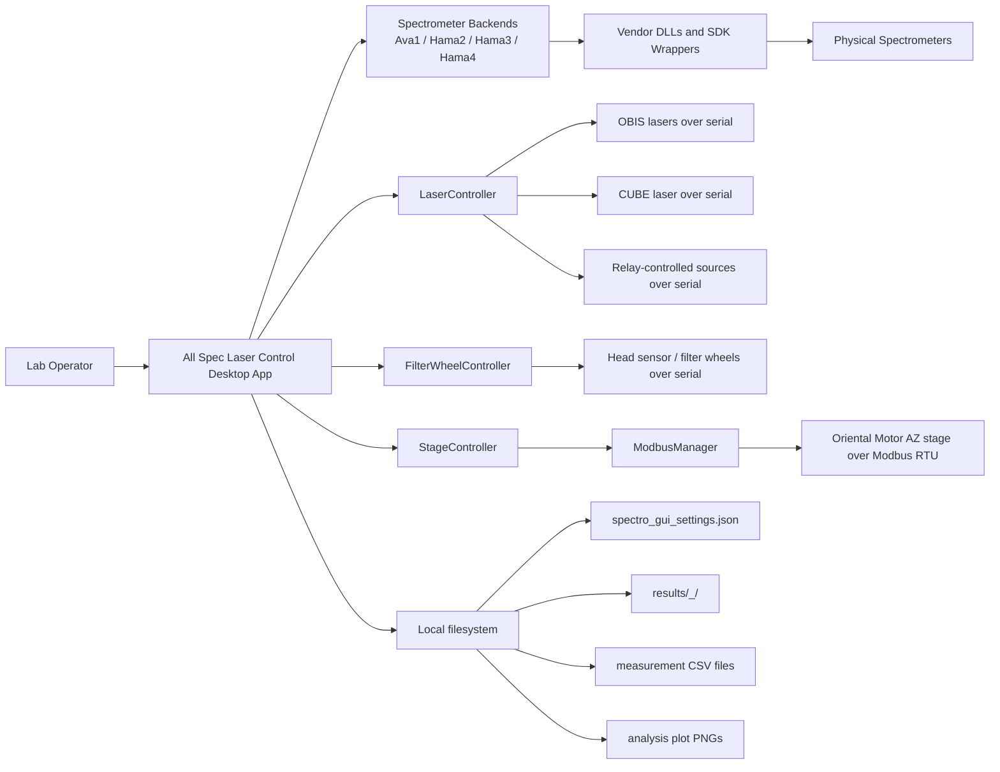
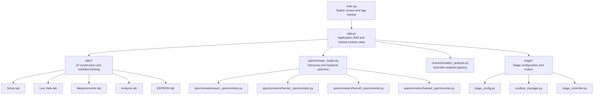
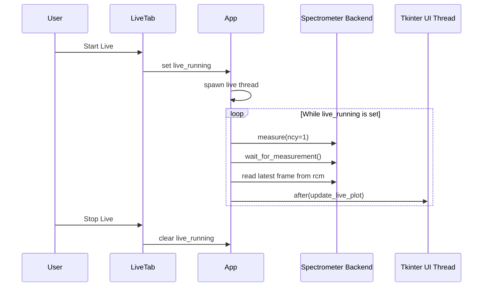
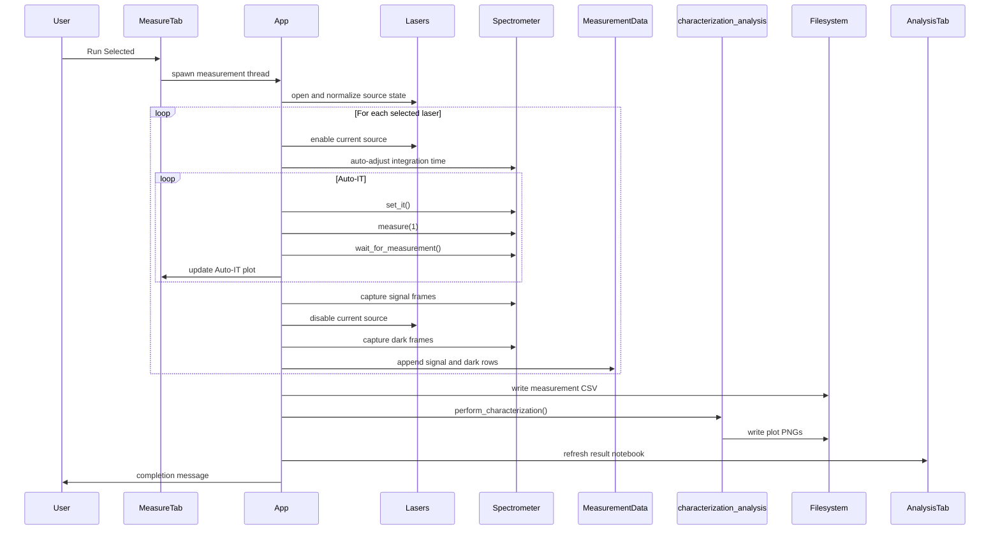
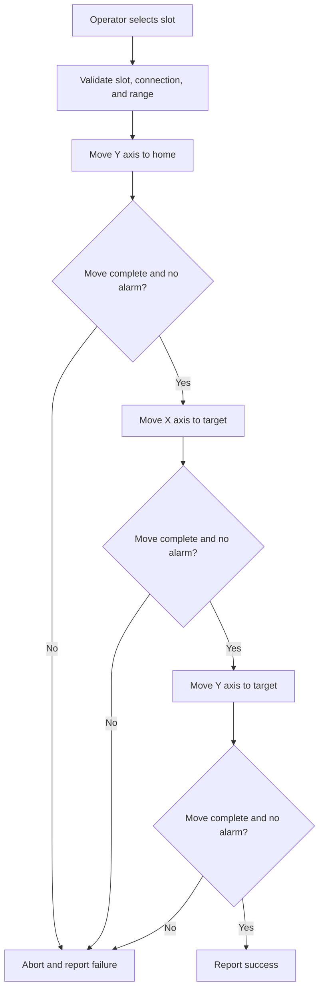
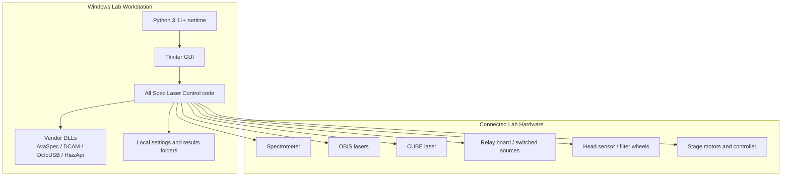
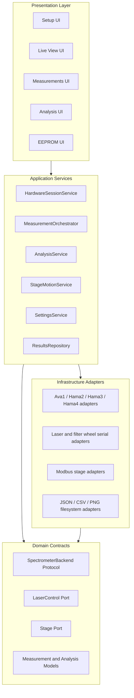

# All Spec Laser Control System Design Document

Document status: Draft 1.0  
Date: 2026-04-06  
Authoring basis: Static architecture review of the current repository

## 1. Purpose and Scope

This document describes the current system design of the All Spec Laser Control application and proposes a target-state architecture for improving maintainability, testability, and operational robustness.

The document covers:

- Desktop application structure
- Hardware integration boundaries
- Runtime workflows for live view, measurement, analysis, EEPROM, and stage control
- Persistence model and file outputs
- Deployment assumptions and platform constraints
- Key architectural risks and recommended refactors

This review is based on the current codebase and does not assume live hardware validation during authoring.

## 2. Executive Summary

All Spec Laser Control is a Python/Tkinter desktop application used to configure spectrometers, control supporting lab hardware, execute automated characterization runs, and generate analysis artifacts. The current architecture is best described as a modular desktop monolith with plugin-style hardware backends.

The design has several strengths:

- Clear operator-facing workflow across Setup, Live View, Measurements, Analysis, and EEPROM tabs
- Practical hardware abstraction for multiple spectrometer families
- Good use of background threads for long-running measurement and motion workflows
- Strong offline capability with local CSV and plot generation

The main architectural risks are:

- Core orchestration logic is concentrated in large modules and a large `SpectroApp` application shell
- Hardware, orchestration, persistence, and UI concerns are partially mixed
- Spectrometer backends share an implicit interface rather than a formal contract
- Error handling and observability are adequate for operator use, but limited for diagnostics and automated validation

The recommended next step is not a full rewrite. The correct path is to preserve the desktop monolith deployment model while refactoring internally toward a layered application with explicit service boundaries and formal device adapter contracts.

## 3. System Overview

### 3.1 Primary Business Function

The application supports spectrometer characterization and lab workflow automation by combining:

- Spectrometer discovery and connection
- Laser source control
- Filter wheel and head sensor control
- Two-axis stage movement
- Live spectrum viewing
- Automated multi-source acquisition
- Offline analysis and artifact generation
- EEPROM inspection and modification for supported devices

### 3.2 Inferred Design Drivers

The following design drivers are inferred from the codebase:

- Support multiple spectrometer families without changing the main operator workflow
- Run on lab workstations without requiring cloud services
- Keep operators in a single GUI for setup, acquisition, analysis, and device maintenance
- Preserve measurement results locally and in human-readable formats
- Tolerate blocking hardware operations by offloading them from the Tkinter UI thread
- Operate in a Windows environment because DLL-backed spectrometer drivers are required

### 3.3 Architectural Style

Current style: modular desktop monolith with adapter-like hardware backends.

Characteristics:

- Single deployable desktop process
- Tkinter notebook as the main interaction shell
- Functional tab builders under `tabs/`
- Shared application state stored on the root `SpectroApp`
- Hardware integration via serial, Modbus RTU, and vendor DLL/SDK wrappers
- Analysis implemented as an in-process computational pipeline

## 4. System Context

## 5. Current Logical Architecture

### 5.1 High-Level Module Decomposition

### 5.2 Component Responsibility Matrix

| Component | Responsibility | Notes |
| --- | --- | --- |
| `main.py` | Splash screen and process startup | Minimal entry point |
| `app.py` | Root application class, shared state, results management, generic helpers | Currently acts as application shell and partial orchestrator |
| `tabs/setup_tab.py` | Device configuration, connection, settings load/save, stage config hookup | Also manages dynamic UI and hardware connection logic |
| `tabs/live_view_tab.py` | Real-time acquisition loop and manual device controls | Uses background thread plus `after()` UI synchronization |
| `tabs/measurements_tab.py` | Automated acquisition workflow, Auto-IT, CSV generation, analysis trigger | Main business workflow orchestration |
| `tabs/analysis_tab.py` | Analysis result visualization and multi-run artifact browser | Presentation only, relatively clean |
| `tabs/eeprom_tab.py` | EEPROM read/write UI for supported spectrometers | Specialized maintenance workflow |
| `spectrometer_loader.py` | Type inference, DLL path selection, discovery, backend connection | Adapter selection layer |
| `spectrometers/*.py` | Vendor-specific spectrometer backends | Large modules with implicit shared interface |
| `stage/*` | Stage config loading, Modbus access, safe motion sequencing | Optional subsystem |
| `characterization_analysis.py` | Scientific post-processing and plot generation | Heavy analytical module, independent of Tkinter |

### 5.3 Runtime State Ownership

The current system relies on a shared mutable application state rooted in `SpectroApp`. The root object owns:

- Current spectrometer instance and backend type
- Hardware configuration and COM ports
- Laser and filter wheel controllers
- Optional stage controller
- Live and measurement thread state flags
- Measurement data accumulated in memory
- Analysis artifacts, references, and result paths
- References to UI widgets created by tab builders

This is pragmatic for a desktop application, but it creates tight coupling between UI code and operational workflows.

## 6. External Interfaces

### 6.1 Spectrometers

Supported families discovered through `spectrometer_loader.py`:

- Ava1
- Hama2
- Hama3
- Hama4

Observed common backend contract:

- `connect()`
- `disconnect()`
- `set_it(it_ms)`
- `measure(ncy=...)`
- `wait_for_measurement()`
- `rcm` for most recent captured counts
- serial number and pixel metadata

Important observation: this contract is implicit. There is no `Protocol`, abstract base class, or formal capability model. Compatibility is enforced by convention.

### 6.2 Laser and Serial Devices

`LaserController` manages three serial channels:

- OBIS for multiple wavelengths
- CUBE for 377 nm
- RELAY for relay-driven sources such as 517 nm, 532 nm, and Hg-Ar

The serial abstraction is lightweight and built on `SerialDevice`.

### 6.3 Head Sensor and Filter Wheels

`FilterWheelController` is another serial device wrapper with command helpers for:

- Device query
- Filter wheel position changes
- Reset
- Test motion

### 6.4 Stage Motion

The stage subsystem uses:

- `StageConfig` to load an external JSON configuration
- `ModbusManager` for thread-safe Modbus RTU communication
- `StageController` for safe multi-step moves

The stage integration is notable because motion safety is encoded directly in the controller by forcing the move sequence:

1. Y axis to home
2. X axis to target
3. Y axis to target

## 7. Detailed Runtime Workflows

### 7.1 Application Startup

Startup sequence:

1. `main.py` displays a splash screen.
2. `SpectroApp` initializes the Tk root window.
3. Shared controllers and state are created.
4. Notebook tabs are instantiated.
5. Tab builder modules attach widgets and workflow methods to the app object.
6. Saved settings are loaded into the UI if present.

Implication: tab modules are not passive views. They actively extend the root app object with behavior, which keeps wiring simple but increases coupling.

### 7.2 Spectrometer Discovery and Connection

Connection flow:

1. Operator selects type or leaves it as `Auto`.
2. `spectrometer_loader.py` selects candidate backend types.
3. DLL path is inferred or taken from user input.
4. Candidate backends perform device discovery.
5. Operator optionally selects from multiple discovered devices.
6. The selected backend is instantiated and connected.
7. `SpectroApp` stores the instance and updates shared measurement metadata.

Strengths:

- Simple operator experience
- Clear fallback behavior for `Auto`
- Backends are isolated from the main GUI by the loader module

Weaknesses:

- Backend capability detection is coarse
- Discovery and connection logic still leaks into UI-oriented code

### 7.3 Live View Workflow

Live view is implemented as a background measurement loop controlled by a `threading.Event`.

Design notes:

- Integration time changes are deferred if a frame is in progress.
- Plot updates are marshaled back onto the UI thread using `after()`.
- Saturation is handled in the UI by clamping displayed values while preserving detection state.

### 7.4 Automated Measurement and Analysis Workflow

This is the core business workflow of the system.

Special cases in the current workflow:

- 640 nm uses a dedicated multi-integration sequence rather than the standard Auto-IT flow.
- Hg-Ar requires an operator-mediated countdown and fiber switch before acquisition.
- The measurement thread also triggers analysis automatically after acquisition.

### 7.5 Stage Safe-Move Workflow

This is a good example of encoded operational safety behavior in the application layer.

## 8. Data Model and Persistence

### 8.1 In-Memory Measurement Model

`MeasurementData` stores rows in memory until persisted.

Logical row shape:

- `Timestamp`
- `Wavelength`
- `IntegrationTime`
- `NumCycles`
- `Pixel_0 ... Pixel_N`

Naming conventions:

- Signal rows use the wavelength tag, for example `405`
- Dark rows use `<tag>_dark`, for example `405_dark`

This is simple and interoperable, but it is effectively a wide denormalized table.

### 8.2 Persisted Files

| Artifact | Location | Purpose |
| --- | --- | --- |
| Settings JSON | `spectro_gui_settings.json` | User configuration persistence |
| Results folder | `results/<serial>_<timestamp>/` | Run-level output container |
| Measurement CSV | Results folder | Raw captured spectra and metadata |
| Plot PNGs | `results/.../plots/` | Analysis artifacts |

`get_writable_path()` also provides a fallback path under the user home directory when writing near the app location is not possible.

### 8.3 Reference CSV Inputs

The analysis pipeline accepts optional reference CSV files with required columns:

- `Wavelength_nm`
- `WavelengthOffset_nm`
- `LSF_Normalized`

This allows measured LSF curves to be overlaid with reference datasets.

## 9. Analysis Pipeline Design

`characterization_analysis.py` is a computation-heavy module that is already better separated than most of the GUI workflow code.

Current pipeline responsibilities include:

- Normalized LSF extraction
- Dark-corrected 640 nm views
- Hg-Ar peak detection and matching
- Dispersion polynomial fitting
- Spectral resolution estimation
- Stray light and slit-function plots
- Optional overlay with reference CSV datasets

Strengths:

- Mostly GUI-independent
- Returns structured artifacts for presentation
- Centralizes scientific calculations in one module

Risks:

- Single large file
- Mixes domain calculations and artifact rendering
- Limited typed metadata for downstream automation

Recommended evolution:

- Separate calculations from plotting
- Return a richer analysis result object with machine-readable metrics
- Keep plot generation as a downstream adapter

## 10. Concurrency and Threading Model

The current application uses a pragmatic thread model:

- UI thread: Tkinter event loop and widget updates
- Live view thread: repeated single-frame acquisitions
- Measurement thread: long-running acquisition and analysis workflow
- Stage move thread: safe slot motion sequence
- Backend-internal threads: vendor-specific implementation details inside spectrometer wrappers

Synchronization patterns:

- `threading.Event` for stop/start control
- `after()` for UI-safe updates
- Backend blocking waits for measurement completion
- Locking inside `ModbusManager` for bus safety

Architectural implication:

The threading model is workable, but there is no unified task orchestration layer. Thread ownership is distributed across modules, which makes future extension harder.

## 11. Deployment View

Deployment constraints:

- Spectrometer driver support is Windows-centric because of DLL dependencies.
- The system is designed for local execution on a workstation directly attached to lab equipment.
- There is no service boundary, remote API, or database dependency in the current architecture.

## 12. Quality Attributes

### 12.1 Reliability

Positive indicators:

- Background threads prevent the UI from being fully blocked during long workflows
- Stage communication is protected with internal locking and retries
- Results are persisted locally in timestamped folders

Gaps:

- No transaction-style rollback across multi-device workflows
- Limited recovery semantics if one subsystem fails mid-run
- Operator-facing errors are shown, but structured diagnostics are limited

### 12.2 Maintainability

Positive indicators:

- Major subsystems exist as named modules
- Spectrometer loading is separated from tab-specific logic

Gaps:

- Several modules are very large
- `SpectroApp` owns too many responsibilities
- UI builders also implement orchestration logic
- Implicit backend interfaces increase regression risk

### 12.3 Extensibility

Positive indicators:

- New spectrometer families can be added through the loader and backend pattern
- New analysis plots can be added centrally

Gaps:

- Adding new hardware often requires touching both orchestration and UI code
- Device capabilities are not modeled explicitly

### 12.4 Safety and Operational Control

Positive indicators:

- Stage move sequencing encodes a safe travel pattern
- EEPROM editing is isolated to a dedicated tab
- Saturation detection is surfaced during live and measurement workflows

Gaps:

- EEPROM writes lack a stronger authorization or audit model
- Hardware command sequencing is not centrally audited

## 13. Current Architectural Risks

### 13.1 Large Module Concentration

The review and the local architecture analyzer both identify multiple oversized modules, including:

- `app.py`
- `characterization_analysis.py`
- `tabs/setup_tab.py`
- `tabs/live_view_tab.py`
- `tabs/measurements_tab.py`
- vendor backend modules under `spectrometers/`

Impact:

- Higher change risk
- Harder onboarding
- Lower unit-test granularity

### 13.2 Implicit Device Contract

Multiple spectrometer backends appear to implement the same shape, but there is no formal contract.

Impact:

- Runtime-only compatibility validation
- Increased likelihood of adapter drift
- Harder static analysis and mocking

### 13.3 Mixed UI and Application Logic

Tab modules both define widgets and implement workflows such as:

- connection orchestration
- measurement sequencing
- hardware state normalization
- CSV and settings persistence

Impact:

- Hard to test without a GUI context
- Hard to reuse logic outside the Tkinter shell

### 13.4 Limited Observability

The application uses logging and message boxes, but does not yet provide:

- structured run identifiers
- device command audit trails
- centralized failure classification
- health/status dashboards

### 13.5 Platform Coupling

The current deployment is correctly optimized for a Windows lab workstation, but vendor DLL dependency makes portability limited by design.

## 14. Recommended Target Architecture

The recommended target is still a desktop monolith. The change should be internal modularization, not service decomposition.

### 14.1 Target Architectural Principles

- Keep one desktop process
- Separate UI, application services, domain models, and infrastructure adapters
- Formalize device contracts
- Isolate persistence and analysis from Tkinter widget code
- Centralize workflow orchestration

### 14.2 Target Logical Architecture

### 14.3 Proposed Internal Services

| Proposed service | Responsibility |
| --- | --- |
| `HardwareSessionService` | Connect, disconnect, and capability reporting for all active devices |
| `MeasurementOrchestrator` | Coordinate Auto-IT, acquisition sequencing, dark frames, and stop conditions |
| `AnalysisService` | Convert measurement data into domain metrics and plot artifacts |
| `StageMotionService` | Encapsulate stage slot movement and safety policy |
| `SettingsService` | Read/write application settings and resolve writable paths |
| `ResultsRepository` | Persist CSVs, plots, and run metadata under a stable schema |

### 14.4 Proposed Domain Contracts

Introduce explicit interfaces such as:

- `SpectrometerBackend`
- `LaserSourceController`
- `FilterWheelPort`
- `StageControllerPort`
- `RunResult`
- `AnalysisMetrics`
- `AnalysisArtifact`

This would make device mocking and unit testing significantly easier.

## 15. Refactor Roadmap

### Phase 1: Low-Risk Structural Cleanup

- Introduce formal backend protocols or abstract base classes
- Extract settings persistence from `setup_tab.py`
- Extract measurement orchestration from `measurements_tab.py`
- Move generic hardware helpers out of `app.py`
- Add run-level logging context with serial number and timestamp

### Phase 2: Workflow Isolation

- Create a dedicated measurement orchestrator module
- Create a dedicated analysis service facade
- Separate plot rendering from metric computation in `characterization_analysis.py`
- Add typed result objects for acquisition and analysis

### Phase 3: Operational Hardening

- Add command audit logging for hardware interactions
- Add capability-driven UI enablement, especially for EEPROM operations
- Add smoke tests with mock backends
- Add packaging and deployment documentation for reproducible workstation installs

## 16. Recommended Near-Term Decisions

If the team wants the highest return with the least disruption, the next three architecture decisions should be:

1. Formalize the spectrometer backend interface.
2. Move measurement workflow logic into a dedicated orchestrator module.
3. Split analysis calculations from plot generation and UI presentation.

These three changes would preserve the current operator experience while materially reducing long-term maintenance cost.

## 17. Appendix: Codebase Mapping

Primary modules reviewed:

- `main.py`
- `app.py`
- `spectrometer_loader.py`
- `characterization_analysis.py`
- `tabs/setup_tab.py`
- `tabs/live_view_tab.py`
- `tabs/measurements_tab.py`
- `tabs/analysis_tab.py`
- `tabs/eeprom_tab.py`
- `stage/stage_controller.py`
- `stage/modbus_manager.py`
- `stage/stage_config.py`
- `spectrometers/ava1_spectrometer.py`
- `spectrometers/hama2_spectrometer.py`
- `spectrometers/hama3_spectrometer.py`
- `spectrometers/hama4_spectrometer.py`

## 18. Conclusion

The current application is a functional and practical lab-control desktop system with real strengths in hardware integration and operator workflow cohesion. Its main challenge is not architectural unsuitability; it is architectural concentration. The safest path forward is to keep the single-process desktop deployment model and progressively refactor the internals into explicit services and contracts.

That approach protects the working product while creating a foundation for cleaner testing, faster feature work, and safer hardware-facing changes.
